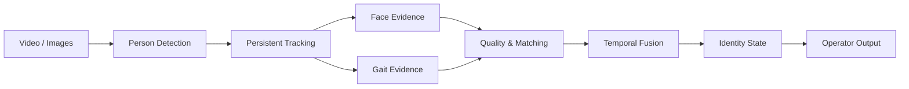

# GaitGuard

### Multimodal Identity Intelligence

A research-oriented biometric identity system combining **face recognition, gait analysis, persistent tracking, and temporal evidence fusion** to maintain reliable identity hypotheses across video.

 

---

## Identity as a Temporal Process

GaitGuard approaches biometric recognition as a continuous evidence problem rather than a single-frame classification task.

Each detected person is represented as a persistent track. Face observations, gait sequences, biometric quality, gallery matches, and previous identity decisions are accumulated over time before an identity state is confirmed or changed.

A valid outcome may therefore be:

**known identity · watchlist identity · visitor · unknown**

`Unknown` is treated as a legitimate result when the available biometric evidence is insufficient.

## Biometric Evidence

### Face

Face observations are evaluated before they enter the identity pipeline. Image quality, visibility, pose, and recognition confidence determine whether a sample contributes useful evidence.

Accepted observations are converted into biometric representations and compared against enrolled identity galleries rather than being trusted from a single image.

### Gait

When facial evidence is unavailable or weak, motion and walking characteristics provide an additional identity signal.

Gait sequences are collected across multiple frames, transformed into identity representations, and matched against an enrolled gait gallery. This gives the system a second biometric channel that is less dependent on a clear frontal face.

### Fusion

Face and gait are treated as complementary evidence sources.

Their outputs are associated with the same tracked person and combined over time, allowing stronger modalities to dominate when appropriate while preventing weak or contradictory observations from immediately replacing an established identity.

---

## Enrollment & Identity Data

Recognition begins with controlled enrollment.

An identity record may contain:

- multiple face images across useful appearance and pose variation
- short walking sequences for gait representation
- generated biometric embeddings or templates
- identity category and internal metadata
- quality and provenance information associated with enrolled samples

The recognition pipeline operates primarily on these derived biometric representations and identity galleries.

Enrollment data should remain **controlled, traceable, and explicitly associated with the identity from which it was collected**. New observations are not automatically allowed to redefine an enrolled identity, reducing the risk of uncontrolled template drift.

---

## Decision Model

GaitGuard favors **stable identity state over instantaneous recognition**.

Identity confirmation depends on accumulated evidence, while changing an established identity requires meaningful counter-evidence. This temporal asymmetry reduces recognition flicker and limits the effect of isolated poor-quality frames.

The system is therefore designed around three principles:

**Evidence quality**  
Low-quality biometric observations should contribute less—or be rejected entirely.

**Temporal consistency**  
Identity should remain coherent across a person's track rather than being recomputed independently for every frame.

**Explicit uncertainty**  
When the available evidence cannot support a reliable match, the system remains unknown instead of forcing the nearest identity.

---

## Research State

The repository currently contains working components for:

- person detection and persistent multi-person tracking
- face identity galleries and recognition logic
- gait extraction, matching, and gait galleries
- multimodal face–gait identity fusion
- biometric enrollment workflows
- temporal identity state management
- operator-facing identity categories and visualization
- evaluation and validation utilities

The broader architecture also defines interfaces for contextual event and risk analysis. Those components should be regarded as an evolving research layer rather than a fully deployed detection system.

---

## Research Scope

GaitGuard is developed as a biometric recognition and identity-fusion research system.

Any dataset, image collection, biometric enrollment process, or real-world deployment involving identifiable individuals must be handled under the applicable requirements for **consent, lawful processing, data minimization, security, retention, and biometric privacy**.

---

**Observe → associate → accumulate evidence → resolve identity**

